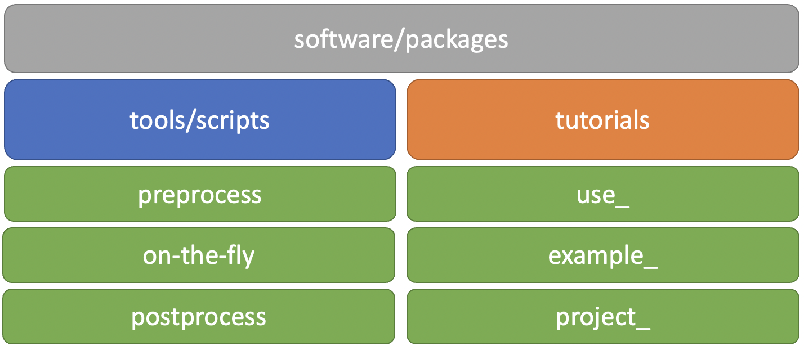
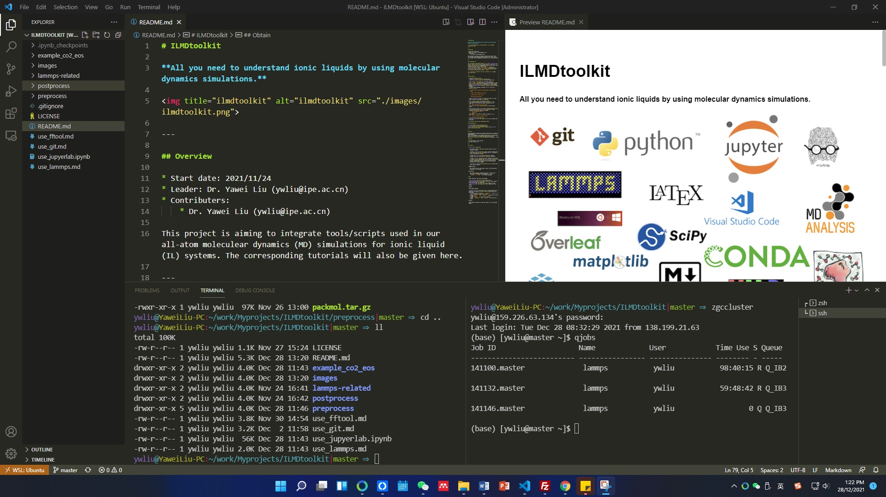
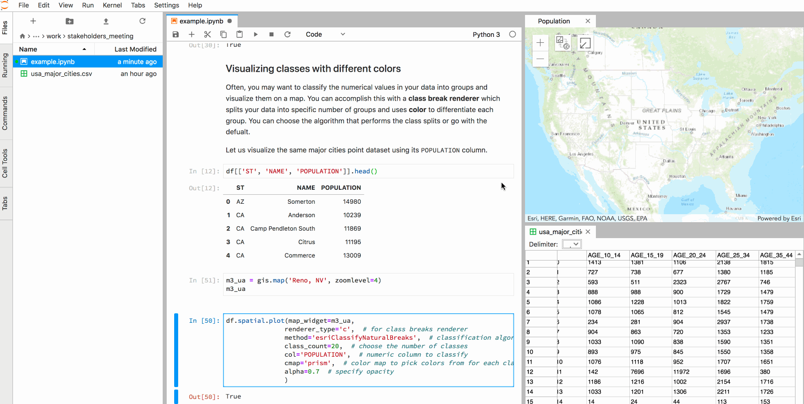

# MolSimulX

[English](README.md) | [中文](README-zh.md)

分子(**Mol**ecular)模拟(**Simul**ation)探索(E**X**ploration)

欢迎**star**和**fork**！

意见、建议和问题？欢迎提交[issues](https://gitee.com/yliu3803/MolSimulX/issues)和[PRs](https://gitee.com/help/articles/4128#article-header2)！

咨询、指导和分子模拟解决方案？欢迎私信！

---

## 概况

* 开始日期: 2021/11/24
* 管理员: 
  * [刘亚伟](https://yaweiliu.github.io/) (ywliu@ipe.ac.cn 2021--)
* 开发者:
  * 李雪夫 (lixuefu2021@ipe.ac.cn 2022--)
  * 徐舒婷 (xushuting2021@ipe.ac.cn 2022--)

本项目包含利用分子模拟手段研究物质的软件、工具、脚本、教程、案例和项目，旨在提供高效的分子模拟、数据分析/可视化、报告生成流程，打造分享分子模拟技巧和科研经验的开放平台。

---

## 搭建工作平台

### 操作系统

推荐使用 [Mac OS](https://www.apple.com/mac/), [Ubuntu Os](https://ubuntu.com/) 等其他 Linux 类操作系统。在 Windows OS 中，可以安装 [WSL Ubuntu](https://docs.microsoft.com/zh-cn/windows/wsl/) 获得在Windows系统中使用Ubuntu子系统的功能。

* 参考 [use_wsl_ubuntu.md](use_wsl_ubuntu.md) 快速了解 WSL Ubuntu 子系统的安装及在 vscode 中的启动(如下图所示)
* 详细内容参考[这里](https://docs.microsoft.com/zh-cn/windows/wsl/install)了解如何在Windows系统中安装 WSL Ubuntu 子系统和[这里](https://docs.microsoft.com/zh-cn/windows/wsl/tutorials/wsl-vscode)了解如何在 vscode 启动 wsl Ubuntu 作为工作平台(如下图所示)

### 安装软件/工具包

* 安装前
  * 大多数软件/工具包将通过在**终端/Terminal**中输入`命令行/commandline`安装
    * 在 Mac Os 中，参考[这里](https://support.apple.com/guide/terminal/welcome/mac)了解 Mac Terminal
    * 在 Ubuntu Os 中，参考[这里](https://www.ubuntubeginner.com/ubuntu-terminal-basics/)了解 Ubuntu Terminal
    * 在 WSL Ubuntu 中, 可以在 vscode 中启动 WSL Ubuntu，通过菜单栏打开 Ubuntu Terminal

  * 终端配置文件 (profile file)
    * 配置文件保存终端的环境设置
    * 对于 bash shell (终端通常默认的解释器)
      * Mac 的终端配置文件为`~/.bash_profile`
      * Ubuntu 的终端配置文件为`~/.bashrc`
      * `~` 表示用户主目录(user’s home directory)
    * 对于 zsh shell (推荐使用[oh-my-zsh](https://github.com/ohmyzsh/ohmyzsh))
      * 终端配置文件为`~/.zshrc`
  * 修改配置文件后，重新打开终端或运行下列命令使修改生效
      * `source ~/.bash_profile` or 
      * `source ~/.bashrc` or 
      * `source ~/.zshrc`

* 安装编译工具
  * gcc/g++
    * `brew install gcc` # for Mac
    * `sudo apt install build-essential` # for Ubuntu
    * `gcc --version` # test
  * make
    * `brew install make` # for Mac
    * `sudo apt install make` # for Ununtu
    * `make --version` # test
  * cmake
    * `brew install cmake` # for Mac
    * `sudo apt install cmake` # for Ununtu
    * `cmake --version` # test

* [git](https://git-scm.com/)
  * 安装 git
    * `brew install git` # for Mac 
    * `sudo apt-get install git` # for Ubuntu
  * 参考 [use_git.md](./use_git.md) 了解 git 的基本使用方法
  * 参考[这里](https://git-scm.com/book/zh/v2)了解更多 git 的细节和使用

* [MolSimulX](https://gitee.com/yliu3803/MolSimulX)
  * 获取 MolSimulX
    * `cd some_folder`
    * `git clone https://gitee.com/yliu3803/MolSimulX.git` # 克隆仓库到本地
  * 更新 MolSimulX
    * `cd MolSimulX` # 进入主仓库目录
    * `git pull` # 更新主仓库

* [python](https://www.python.org/) 和 python packages
  * 安装 [miniconda](https://docs.conda.io/en/latest/miniconda.html) (轻量级 conda 安装包) 或 [anaconda](https://www.anaconda.com/) (包含大量 python packages)
  * 通过 `conda` 安装 pyhton packages 

    `conda install numpy pandas scipy matplotlib` # 数据分析包

    `conda install nodejs` # 插件
    
    `conda install -c conda-forge MDanalysis MDAnalysisTests nglview` # MD轨迹分析和可视化

    `conda install -c conda-forge freud fresnel` # MD轨迹分析和可视化

    `pip install plato-draw` # 可视化

    `pip install wulffpack` # 晶体颗粒Wulff构造

    `pip install ase` # 模拟软件，可构造各种分子/晶体结构

    注：各安装包可通过`pip`或`conda`安装，详细安装说明参见相应的官方说明文档。
* [fftool](https://github.com/paduagroup/fftool) 和 [fftoolx](./preprocess/fftool/fftoolx)
  * 该工具已包含在 [preprocess](./preprocess) 文件夹
  * 在终端配置文件中添加 `export PATH=<path_to_fftool>:$PATH`
  * 参考 [use_fftool.md](./use_fftool.md) 了解fftool的基本使用方法
  * fftoolx添加了一些新的功能：
    * 更多的元素种类
    * 添加‘-noguess’选项，关闭fftool重新分析分子链接信息
    * 二面角(dihedral)支持[quadratic](https://docs.lammps.org/dihedral_quadratic.html)类型
  
* [packmol](http://leandro.iqm.unicamp.br/m3g/packmol/home.shtml)
  * 该工具已包含在 [preprocess](./preprocess) 文件夹
  * 解压文件并编译
    * `tar zxvf packmol.tar.gz`
    * `cd packmol`
    * `make`
  * 在终端配置文件中添加 `export PATH=<path_to_fftool>:$PATH`

* [lammps](https://www.lammps.org/)
  * 参考 [use_lammps.md](./use_lammps.md) 了解如何编译安装 lammps
  

* [vmd](https://www.ks.uiuc.edu/Research/vmd/)

### 数据处理平台

[jupyterlab](https://jupyter.org/) 是一个基于 Web 的，集合笔记、代码和数据的交互式开发环境。

 

* 安装 jupyterlab
  * `conda install jupyterlab`
  
* 参考 [use_jupyerlab.ipynb](./use_jupyerlab.ipynb) 了解 jupyterlab 的基本使用方法

### 其他推荐

* [markdown](https://www.markdownguide.org/)
* [latex](https://www.latex-project.org/get/) 和 [overleaf](https://www.overleaf.com/)

---

## 内容

### [preprocess](./preprocess) # 预处理

  该文件夹包含了模拟预处理工具和文件，如分子结构/力场文件、初始结构生成工具和脚本。

  * [clandp](./preprocess/clandp) 文件夹包含了由 [Padua Group](https://github.com/paduagroup/clandp) 提供的多种离子液体结构文件和力场文件

  * [molecules](./preprocess/molecules) 包含了常见分子的结构文件和力场文件

  * [ions](./preprocess/ions)包含了一些离子的结构文件和力场文件

  * [metals](./preprocess/metals)包含了一些金属的LJ力场参数

  * [fftool](./preprocess/fftool) 文件夹包含了 fftool 的源文件，与 [packmol](http://leandro.iqm.unicamp.br/m3g/packmol/home.shtml) 一起可以利用分子的结构/力场文件生成用于分子模拟的初始结构和文件

  * [packmol.tar.gz](./preprocess/packmol.tar.gz) 包含了 packmol 的源文件

### on-the-fly # 即时处理

  该文件夹包含结合分子模拟软件，在模拟中即时处理数据，实现特殊模拟功能（如伞型抽样、向前流抽样等）的工具和脚本。

### [postprocess](./postprocess) # 后处理

  该文件夹包含对分子模拟结果分析/可视化和报告生成的工具和软件，主要基于 python 和 markdown 等工具。

  * [PyLAT](./postprocess/PyLAT) 包含了 [PyLAT](https://github.com/MaginnGroup/PyLAT) 的源文件

### use_ # 基本使用

  该系列文件/文件夹包含各种软件/工具包的基本安装/使用方法
  
  * [use_git.md](./use_git.md) # git 的基本使用方法
  
  * [use_jupyerlab.ipynb](./use_jupyerlab.ipynb) # jupyterlab 和 python 包的基本使用方法
  
  * [use_fftool.md](./use_fftool.md) # fftool 的基本使用方法
  
  * [use_lammps.md](./use_lammps.md) # 编译和安装lammps

  * [use_wsl_ubuntu.md](./use_wsl_ubuntu.md) # 安装及在 vscode 中使用 WSL Ubuntu 

 * [use_pylat.md](./use_pylat.md) # pylat 的基本使用方法

### example_ # 案例
  
  该系列文件/文件夹包含一些简单的模拟和数据分析案例。

  * [example_CO2_EOS](./example_CO2_EOS) 分子动力学模拟计算 CO$_2$ 的状态方程，详见 [co2_eos.ipynb](./example_CO2_EOS/co2_eos.ipynb)  
    
      `python` `jupyterlab` `fftool` `packmol` `lammps` `mdanalysis` `nglview`
  *  [example_BmimPF6_ACN_CG](./example_BmimPF6_ACN_CG) 粗粒化分子动力学模拟BmimPF6和ACN的混合液，详见 [BmimPF6_ACN_mixture.ipynb](./example_BmimPF6_ACN_CG/BmimPF6_ACN_mixture.ipynb)
  
      `python` `jupyterlab` `fftool` `packmol` `lammps` `mdanalysis` `nglview`

  *  [example_Wulff_Ru_cluster](./example_Wulff_Ru_cluster) 构建*hcp*结构Ru晶体的Wulff颗粒，详见 [wulff_Ru.ipynb](./example_Wulff_Ru_cluster/wulff_Ru.ipynb)
  
      `python` `jupyterlab` `ase` `wulffpack` `nglview`

 *  [example_water_between_two_walls](./example_water_between_two_walls) 构建水分子在两个固体基质之间的构型，生成`lammps`输入文件，详见[water_between_two_walls.ipynb](./example_water_between_two_walls/water_between_walls.ipynb)
  
      `python` `jupyterlab` `ase` `fftool` `packmol` `nglview` 

 *  [example_il_com_orientation](./example_il_com_orientation) 计算离子液体中阳离子的质心坐标和方位向量，详见[il_com_orientation.ipynb](./example_il_com_orientation/il_com_orientation.ipynb)
  
      `python` `jupyterlab` `mdanalysis` `nglview`

 *  [example_mechanical_barostat](./example_mechanical_barostat) 一种机械式的控压力方法，详见[mechanical_barostat.ipynb](./example_mechanical_barostat/mechanical_barostat.ipynb)
  
      `python` `jupyterlab` `mdanalysis` `nglview` `lammps`

### project_ # 项目

  该系列文件夹包含小项目代码。

  * [project_Martini_CG_ILs](./project_Martini_CG_ILs/) 建立离子液体的Martini3粗粒化模型，详见 [build_CG_model.ipynb](./project_Martini_CG_ILs/build_CG_model.ipynb)  

      `python` `jupyterlab` `mdanalysis` `nglview` `lammps` `fftoolx` `VMD`

## 发表论文
### 2022
* Antifouling Graphene Oxide Membranes for Oil-Water Separation via Hydrophobic Chain Engineering. [*Nat. Commun.* 2022, 13 (1), 7334.](https://doi.org/10.1038/s41467-022-35105-8)
* Covalent Organic Framework Membranes for Efficient Separation of Monovalent Cations. [*Nat. Commun.* 2022, 13 (1), 7123.](https://doi.org/10.1038/s41467-022-34849-7)
* The Thermodynamic Origins of Chiral Twist in Monolayer Assemblies of Rod-like Colloids. [*Nanoscale* 2022, 14, 16837.](https://doi.org/10.1039/D2NR05230J) [**[Nanoscale 2023 Emerging Investigators](https://pubs.rsc.org/en/journals/articlecollectionlanding?sercode=nr&themeid=589c4c49-0d90-4579-a206-fa4a268bbe6a)**]
* Short Hydrogen-Bond Network Confined on COF Surfaces Enables Ultrahigh Proton Conductivity. [*Nat. Commun.* 2022, 13 (1), 6666.](https://doi.org/10.1038/s41467-022-33868-8)
* Charged Nanochannels in Covalent Organic Framework Membranes Enabling Efficient Ion Exclusion. [*ACS Nano* 2022, 16 (8), 11781.](https://doi.org/10.1021/acsnano.2c04767)
* A General Method for Direct Assembly of Single Nanocrystals. [*Adv. Opt. Mater.* 2022, 10 (14), 2200179.](https://doi.org/10.1002/adom.202200179)
* Confined Assembly of Colloidal Nanorod Superstructures by Locally Controlling Free‐Volume Entropy in Nonequilibrium Fluids. [*Adv. Mater.* 2022, 34 (28), 2202119.](https://doi.org/10.1002/adma.202202119)
* Ultrafast Seawater Desalination with Covalent Organic Framework Membranes. [*Nat. Sustain.* 2022, 5 (6), 518.](https://doi.org/10.1038/s41893-022-00870-3) [**[封面文章](https://www.nature.com/natsustain/volumes/5/issues/6)**]
* Nanoscale Faceting and Ligand Shell Structure Dominate the Self‐Assembly of Nonpolar Nanoparticles into Superlattices. [*Adv. Mater.* 2022, 34 (20), 2109093.](https://doi.org/10.1002/adma.202109093) [**chemeurope.com等媒体报道**]
* Charged Nanochannels Endow COF Membrane with Weakly Concentration-Dependent Methanol Permeability. [*J. Memb. Sci.* 2022, 645, 120186.](https://doi.org/10.1016/j.memsci.2021.120186)

### 2011-2021 (部分)
* A Dissipative Particle Dynamics Model for Studying Dynamic Phenomena in Colloidal Rod Suspensions. [*J. Chem. Phys.* 2021, 154 (10), 104120.]( https://doi.org/10.1063/5.0041285) [**Editor's Pick**]
* Direct Assembly of Vertically Oriented, Gold Nanorod Arrays. [*Adv. Funct. Mater.* 2021, 31 (6), 2006753.](https://doi.org/10.1002/adfm.202006753) [**eurekalert!、phys.org等媒体报道**]
* Hamiltonian Transformation to Compute Thermo-Osmotic Forces. [*Phys. Rev. Lett.* 2018, 121 (6), 068002.]( https://doi.org/10.1103/PhysRevLett.121.068002)
* Molecular Simulation of Thermo-Osmotic Slip. [*Phys. Rev. Lett.* 2017, 119 (3), 038002.](https://doi.org/10.1103/PhysRevLett.119.038002)
* Microscopic Marangoni Flows Cannot Be Predicted on the Basis of Pressure Gradients. [*Phys. Rev. Lett.* 2017, 119 (22), 224502.](https://doi.org/10.1103/PhysRevLett.119.224502) [**[北京化工大学首篇学生PRL论文](https://mp.weixin.qq.com/s/neGXsEnMKpOPm2pv3Vt0XA)**]
* A Unified Mechanism for the Stability of Surface Nanobubbles: Contact Line Pinning and Supersaturation. [*J. Chem. Phys.* 2014, 141 (13), 134702.](https://doi.org/10.1063/1.4896937)
* Nanobubble Stability Induced by Contact Line Pinning. [*J. Chem. Phys.* 2013, 138 (1), 014706.](https://doi.org/10.1063/1.4773249)
* How Nanoscale Seed Particles Affect Vapor-Liquid Nucleation. [*J. Chem. Phys.* 2011, 135 (18), 184701.](https://doi.org/10.1063/1.3658502)