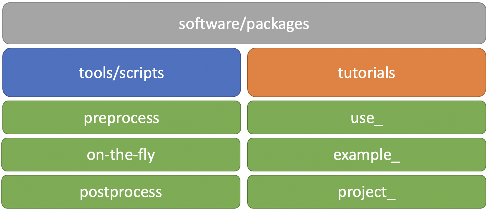
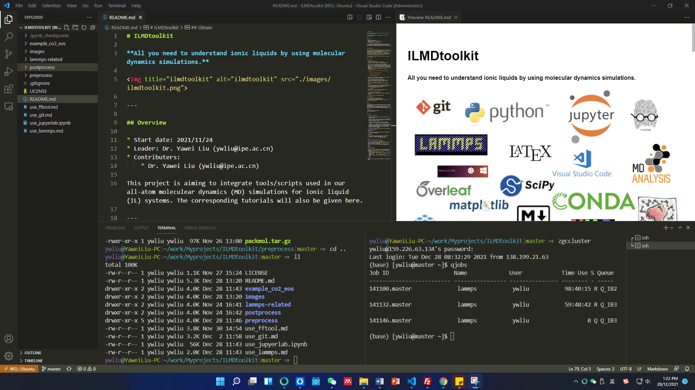

# MolSimulX

[English](README.md) | [中文](README-zh.md)


**Mol**ecular **Simul**ation E**X**ploration

Feel free to **star** and **fork**!

Any comments, suggestions, and questions? Open an [issue](https://gitee.com/yliu3803/MolSimulX/issues) or submit [PRs](https://gitee.com/help/articles/4128#article-header2)!

---

## Overview

* Start date: 2021/11/24
* Maintainers: 
  * Dr. Yawei Liu (ywliu@ipe.ac.cn)

This project is aiming to integrate tools/scripts used in our all-atom molecular dynamics (MD) simulations of matters. The corresponding tutorials and examples will also be given here.




---

## Build work platform

### OS

[Mac OS](https://www.apple.com/mac/), [Ubuntu Os](https://ubuntu.com/) and other Linux type OS are recommended. In Windows OS, you can install [wsl Ubuntu](https://docs.microsoft.com/en-us/windows/wsl/), and then use the WSL Ubuntu as a subsystem in Windows OS.

* see [use_wsl_ubuntu.md](use_wsl_ubuntu.md) for a simple tutorial on how to instal WSL Ubuntu in Windows OS and to launch WSL Ubuntu in vsode (see below figure)

* more details can be found [here](https://docs.microsoft.com/en-us/windows/wsl/install) for how to install WSL Ubuntu and [here](https://docs.microsoft.com/en-us/windows/wsl/tutorials/wsl-vscode) for how to use WSL Ubuntu invscode (see below figure)



### Install software/packages

* before installation
  * most software/pakcages are installed via ```code command``` in **Terminal**
    * In Mac Os, see [here](https://support.apple.com/guide/terminal/welcome/mac) for Mac Terminal
    * In Ubuntu OS, see [here](https://www.ubuntubeginner.com/ubuntu-terminal-basics/) for Ubuntu Terminal
    * In WSL Ubuntu, you can launch WSL Ubuntu in vscode, and then open a Ubuntu Terminal from the menu bar

  * bash profile
    * a bash profile is a file used to store environment settings for your terminal, and it is 
      * for ```bash shell```
        *  ```~/.bash_profile``` in Mac and ```~/.bashrc``` in Ubuntu (```~``` represents the user’s home directory)
      * for ```zsh shell``` ([oh-my-zsh](https://github.com/ohmyzsh/ohmyzsh) for ```zsh``` is highly recommanded)
        * ```~/.zshrc``` in both Mac and Ubuntu
    * for the changes in the profile file to be applied, run the source command with the file as an argument
        * ```source ~/.bash_profile``` or 
        * ```source ~/.bashrc``` or 
        * ```source ~/.zshrc```

* install compiler
  * gcc/g++
    * ```brew install gcc``` # for Mac
    * ```sudo apt install build-essential``` # for Ubuntu
    * test ```gcc --version```
  * make
    * ```brew install make``` # for Mac
    * ```sudo apt install make``` # for Ununtu
    * test ```make --version```
  * cmake
    * ```brew install cmake``` # for Mac
    * ```sudo apt install cmake``` # for Ununtu
    * test ```make --version```

* [git](https://git-scm.com/)
  * install git, see [here](https://git-scm.com/downloads) for details
    * ```brew install git``` # for mac
    * ```sudo apt-get install git``` # for Ubuntu
  * see [use_git.md](./use_git.md) for basic usage of git
  * see [here](https://git-scm.com/book/en/v2) for more details of git


* [MolSimulX](https://gitee.com/yliu3803/MolSimulX)
  * obtain MolSimulX
    * ```cd some_folder```
    * ```git clone https://gitee.com/yliu3803/MolSimulX.git```
  * update MolSimulX
    * ```cd MolSimulX```
    * ```git pull```

* [python](https://www.python.org/) and python packages
  * install [miniconda](https://docs.conda.io/en/latest/miniconda.html) (recommended for limited storage space) or [anaconda](https://www.anaconda.com/) (most python packages are already included)
  
  * install pyhton packages including via ```conda```

    ```conda install numpy pandas scipy matplotlib```

    ```conda install nodejs```
    
    ```conda install -c conda-forge MDanalysis MDAnalysisTests nglview```

    ```conda install -c conda-forge freud fresnel```

    ```pip install plato-draw```

    ```pip install wulffpack```

    ```pip install ase```

    Tip：Packages can be install via ```pip``` or ```conda```, see details in corresponding official documents.

  
* [fftool](https://github.com/paduagroup/fftool)
  * also can be found in [ilmdtoolkit/preprocess](./preprocess) folder

  * add fftool to the PATH environment variable
    * in bash profile, add```export PATH=path_to_fftool:$PATH```
  
  * see [use_fftool.md](./use_fftool.md) for basic usage of fftool
  
* [packmol](http://leandro.iqm.unicamp.br/m3g/packmol/home.shtml)
  * also can be found in [ilmdtoolkit/preprocess](./preprocess) folder

  * expand the files and compile the package

    * ```tar zxvf packmol.tar.gz```
    * ```cd packmol```
    * ```make```
  
  * add packmol to the PATH environment variable

    * in bash profile, add ```export PATH=path_to_packmol:$PATH```

* [lammps](https://www.lammps.org/)
  * see [use_lammps.md](./use_lammps.md) for how to compile your own lammps

* [vmd](https://www.ks.uiuc.edu/Research/vmd/)

### Data processing platform

[Jupyterlab](https://jupyter.org/) is a web-based interactive development environment for notebooks, code, and data. Its flexible interface allows users to configure and arrange workflows in data science, scientific computing, computational journalism, and machine learning.

 

* install jupyterlab
  * ```conda install jupyterlab```
  
* see [use_jupyerlab.ipynb](./use_jupyerlab.ipynb) for basic usage of python and packages in jupyterlab

### Other recommendations

* [markdown](https://www.markdownguide.org/)
* [latex](https://www.latex-project.org/get/) and [overleaf](https://www.overleaf.com/)

---

## Content

### [preprocess](./preprocess) # 预处理

  This folder contains some tools and files used to set up a simulation system.

  * folder [clandp](./preprocess/clandp) contains topology and force field files for ILs, provided by [Padua Group](https://github.com/paduagroup/clandp).

  * folder [molecules](./preprocess/molecules) contains topology and force field files for some small molecules.

  * [ions](./preprocess/ions) contains topology and force field files for some ions.

  * folder [fftool](./preprocess/fftool) contains source codes of fftool, which, combined with [packmol](http://leandro.iqm.unicamp.br/m3g/packmol/home.shtml), can be used to build initial configrautions and data files for MD simulations carried out in, such as LAMMPS.

  * [packmol.tar.gz](./preprocess/packmol.tar.gz) contains the source code of packmol.

### on-the-fly # 即时处理
    
  This folder contains some tools/srcipts combined with other simulation tools to perform special simulations (e.g. rare event techniques).

### [postprocess](./postprocess) # 后处理
    
  This folder contains some python scripts to analyse/visulise the simulation data (depends on ```numpy```, ```pandas```, ```scipy```, etc. python packages) and to generate the final report (depends on ```markdown```, ```latex```).
    
  * [PyLAT](./postprocess/PyLAT) has source codes of [PyLAT](https://github.com/MaginnGroup/PyLAT)

### use_

  Basics usage for some tools and packages.

  * [use_git.md](./use_git.md) # basic usage of git.
  
  * [use_jupyerlab.ipynb](./use_jupyerlab.ipynb) # basic usage of python and packages in jupyterlab.
  
  * [use_fftool.md](./use_fftool.md) # basic usage of fftool.
  
  * [use_lammps.md](./use_lammps.md) # how to compile your own Lammps.

  * [use_wsl_ubuntu.md](./use_wsl_ubuntu.md) # install WSL Ubuntu and use it with vscode

### example_

  Some simple examples.

  * [example_co2_eos](./example_co2_eos): MD simulaitons to calculate the equation of state of CO$_2$, see details in [co2_eos.ipynb](./example_co2_eos/co2_eos.ipynb)

    ```python``` ```jupyterlab``` ```fftool``` ```packmol``` ```lammps``` ```mdanalysis``` ```nglview```
  *  [example_BmimPF6_ACN_CG](./example_BmimPF6_ACN_CG) Coarse-grained MD simulations of BmimPF6-ACN mixtures，see details in [BmimPF6_ACN_mixture.ipynb](./example_BmimPF6_ACN_CG/BmimPF6_ACN_mixture.ipynb)
  
      ```python``` ```jupyterlab``` ```fftool``` ```packmol``` ```lammps``` ```mdanalysis``` ```nglview```

  *  [example_Wulff_Ru_cluster](./example_Wulff_Ru_cluster) build Wulff cluster of Ru *hcp* crystal，see details in [wulff_Ru.ipynb](./example_Wulff_Ru_cluster/wulff_Ru.ipynb)
  
      ```python``` ```jupyterlab``` ```ase``` ```wulffpack``` ```nglview```

 *  [example_water_between_two_walls](./example_water_between_two_walls) build a configuration with water molecules between two different substrates, and create ```lammps``` input files，see details in [water_between_two_walls.ipynb](./example_water_between_two_walls/water_between_walls.ipynb)
  
      ```python``` ```jupyterlab``` ```ase``` ```fftool``` ```packmol``` ```nglview``` 

* project_
  
  These folders contains all codes and details of our published papers.


## Publications
### 2022
* A General Method for Direct Assembly of Single Nanocrystals. [Adv. Opt. Mater. 2022, 10 (14), 2200179.](https://doi.org/10.1002/adom.202200179)
* Confined Assembly of Colloidal Nanorod Superstructures by Locally Controlling Free‐Volume Entropy in Nonequilibrium Fluids. [Adv. Mater. 2022, 34 (28), 2202119.](https://doi.org/10.1002/adma.202202119)
* Ultrafast Seawater Desalination with Covalent Organic Framework Membranes. [Nat. Sustain. 2022, 5 (6), 518–526.](https://doi.org/10.1038/s41893-022-00870-3)
* Nanoscale Faceting and Ligand Shell Structure Dominate the Self‐Assembly of Nonpolar Nanoparticles into Superlattices. [Adv. Mater. 2022, 34 (20), 2109093.](https://doi.org/10.1002/adma.202109093)
* Charged Nanochannels Endow COF Membrane with Weakly Concentration-Dependent Methanol Permeability. [J. Memb. Sci. 2022, 645, 120186.](https://doi.org/10.1016/j.memsci.2021.120186)

### 2011-2021 (part)
* A Dissipative Particle Dynamics Model for Studying Dynamic Phenomena in Colloidal Rod Suspensions. [J. Chem. Phys. 2021, 154 (10), 104120.]( https://doi.org/10.1063/5.0041285) [**JCP Editor's Pick**]
* Direct Assembly of Vertically Oriented, Gold Nanorod Arrays. [Adv. Funct. Mater. 2021, 31 (6), 2006753.](https://doi.org/10.1002/adfm.202006753) 
* Hamiltonian Transformation to Compute Thermo-Osmotic Forces. [Phys. Rev. Lett. 2018, 121 (6), 068002.]( https://doi.org/10.1103/PhysRevLett.121.068002)
* Molecular Simulation of Thermo-Osmotic Slip. [Phys. Rev. Lett. 2017, 119 (3), 038002.](https://doi.org/10.1103/PhysRevLett.119.038002)
* Microscopic Marangoni Flows Cannot Be Predicted on the Basis of Pressure Gradients. [Phys. Rev. Lett. 2017, 119 (22), 224502.](https://doi.org/10.1103/PhysRevLett.119.224502)
* A Unified Mechanism for the Stability of Surface Nanobubbles: Contact Line Pinning and Supersaturation. [J. Chem. Phys. 2014, 141 (13), 134702.](https://doi.org/10.1063/1.4896937)
* Nanobubble Stability Induced by Contact Line Pinning. [J. Chem. Phys. 2013, 138 (1), 014706.](https://doi.org/10.1063/1.4773249)
* How Nanoscale Seed Particles Affect Vapor-Liquid Nucleation. [J. Chem. Phys. 2011, 135 (18), 184701.](https://doi.org/10.1063/1.3658502)

