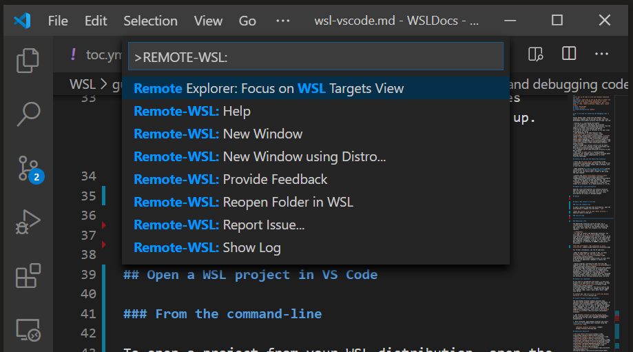

# WSL Ubuntu

**Use Ubuntu OS in vscode as a subsystem in Windows OS**

---

- [WSL Ubuntu](#wsl-ubuntu)
  - [Install wsl Ubuntu in Windows OS](#install-wsl-ubuntu-in-windows-os)
  - [Set up your Linux user info](#set-up-your-linux-user-info)
  - [Install vscode and Remote wsl extension](#install-vscode-and-remote-wsl-extension)
  - [Launch WSL Ubuntu in vscode](#launch-wsl-ubuntu-in-vscode)

## Install wsl Ubuntu in Windows OS

* Windows 10 version 2004 and higher (Build 19041 and higher) or Windows 11 is required
  
* open an administrator PowerShell or Windows Command Prompt 

* type ```wsl --install``` (ubuntu will be installed as a default Linux distribution)

* restart your machine

## Set up your Linux user info

* open the distribution (i.e., Ubuntu by default) from the Start menu
* create a User Name and Password for your Linux distribution by following the following the the instructions

## Install vscode and Remote wsl extension

* download [vscode](https://code.visualstudio.com/download) and install it on Windows (not in your wsl Ubuntu subsystem)

* install the [Remote Development extension pack](https://marketplace.visualstudio.com/items?itemName=ms-vscode-remote.vscode-remote-extensionpack)

## Launch WSL Ubuntu in vscode

* open vscode
* ```CTRL+SHIFT+P``` to bring up the command palette
* type ```Remote-WSL``` and select one to launch WSL Ubuntu
  


* you shoud see **WSL: Ubuntu** at the left bottom as shown below

